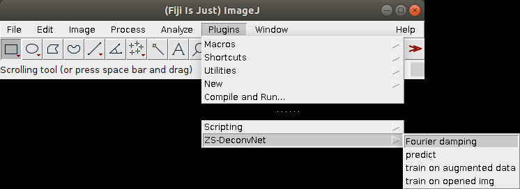

# Tutorial of Zero-Shot DeconvNet Fiji plugin

*** 

## 1. Installation

You can follow the instructions below to install the plugin:

- Copy `./jars/*` and `./plugins/*` to your root path of Fiji `[your root path of Fiji]/Fiji.app/`.

- Restart Fiji.

- Start the ZS-DeconvNet Fiji Plugin:

If you run into problems running Fiji on workstations with Windows system, please try copying `[your root path of Fiji]/Fiji.app/lib/win64/tensorflow_jni.dll` to `C:/Windows/System32/`.

We mainly developed and tested the ZS-DeconvNet Fiji plugin on workstations of Linux and Windows operating system equipped with Nvidia graphics cards. Because TensorFlow-GPU package is currently incompatible with MacOS, we are sorry that MacBook users can only use the TensorFlow-CPU to run our ZS-DeconvNet Fiji plugin at present, which is relatively inefficient compared to Nvidia GPU-based computation. We’ll be looking for the solutions and trying to make our plugin compatible with MacBook for higher efficiency in the future.

****

## 2. Set CPU/GPU and TensorFlow version

The ZS-DeconvNet Fiji plugin was developed based on TensorFlow-Java 1.15.0, which is compatible with CUDA version of 10.1 and cuDNN version of 7.5.1. The default option is to use CPU, but if you would like to run with GPU, or process models with a different TensorFlow version, please follow these steps:

- Open **Edit > Options > Tensorflow**, and choose the version matching your model or setting.
- Wait until a message pops up telling you that the library was installed.
- Restart Fiji.

 Option > Tensorflow" />

****

## 3. Inference with ZS-DeconvNet Fiji plugin

Given a pre-trained ZS-DeconvNet model and an image or stack to be processed, the Fiji plugin is able to generate the corresponding denoised (optional) and super-resolved deconvolution image or stack. The workflow includes following steps:

- Open the image or stack in Fiji and start ZS-DeconvNet plugin by Clicking **Plugins > ZS-DeconvNet > predict**.

- Select the network model file, i.e., .zip file in the format of BioImage Model Zoo bundle. Of note, the model file could be trained and saved either by Python codes (see [this gist](https://gist.github.com/asimshankar/000b8d276f211f972168afa138eb3cc7)) or ZS-DeconvNet Fiji plugin, but has to be saved with TensorFlow environment <= 1.15.0.

- Check inference hyper-parameters. The options and parameters here are primarily selected to properly normalize the input data (NormalizeInput, PercentileBottom, and PercentileTop), perform tiling prediction to save memory of CPUs or GPUs (Number of tiles, Overlap between tiles, and Batch size), and decide whether to show progress dialog and denoising results or not (Show progress dialog and Show denoising result). A detailed description table is shown below:
  
  | Hyper-parameter                    | Default value | Description                                                                                                                                                                                                                                                                                                                                                                                                                                                 |
  |:----------------------------------:|:-------------:|:-----------------------------------------------------------------------------------------------------------------------------------------------------------------------------------------------------------------------------------------------------------------------------------------------------------------------------------------------------------------------------------------------------------------------------------------------------------:|
  | NormalizeInput                     | Yes           | If you tick this hyper-parameter, the image or stack to be processed will be normalized.                                                                                                                                                                                                                                                                                                                                                                    |
  | PercentileBottom, PercentileTop    | 0,100         | These two hyper-parameters are valid only when you tick NormalizeInput, under which circumstance the pixels with value in the range PercentileBottom%-PercentileTop% will be normalized to [0,1].                                                                                                                                                                                                                                                           |
  | Number of tiles                    | 1             | The number of image(stack) sections that the image(stack) will be divided to. Each tile will be processed separately. When the image processing is done, all processed tiles will be fused together. This separate – fuse procedure is designed for the circumstances when the image or stack is too large, and is not necessary if your memory is enough. In the latter case, just set Number of tiles to 1, and the image or stack will not be segmented. |
  | Overlap between tiles              | 32            | The overlapping size between adjacent tiles in pixels. Has to be big enough so that the edge of tiles can merge well.                                                                                                                                                                                                                                                                                                                                       |
  | Batch size                         | 1             | The batch size of inference network. Has to be smaller than the number of tiles. Bigger batch size takes up more memory, but accelerates the image processing.                                                                                                                                                                                                                                                                                              |
  | Import model (.zip)                | /             | Click <i>Browse</i> to select the pre-trained model, or enter the root path in the box. <b>The pre-trained model has to be saved in Tensorflow <= 1.15.0 environment.</b>                                                                                                                                                                                                                                                                                   |
  | Adjust mapping of TF network input | /             | Click if you want to adjust the input 3D stack from x-y-t to x-y-z. It is recommended that you click this button every time you want to process a 3D stack, unless you are very sure the stack is in x-y-z order.                                                                                                                                                                                                                                           |
  | Show progress dialog               | Yes           | Tick if you want to see the progress bar and the time elapse of image processing.                                                                                                                                                                                                                                                                                                                                                                           |
  | Show denoise result                | Yes           | Tick if you want to see the denoised output.                                                                                                                                                                                                                                                                                                                                                                                                                |
  
  Please note that when using 3D ZS-DeconvNet model, make sure the third
  dimension of the stack is matched with `3[153]` dimension of the model:

- Image processing with status bar shown in the message box (if select Show progress dialog).
  
  
 

- The denoised (if select Show denoising result) and deconvolved output will pop out in separate Fiji windows automatically. Then the processed images or stacks could be viewed, manipulated, and saved via Fiji.

Optional Fourier Damping post-processing used to suppress the stripy artifacts in LLS can be done by:

- Open Fiji and choose the images to be processed.

- Click **Plugins > ZS-DeconvNet > Fourier damping**
  
  
 

- Adjust the width (green bar) and length (magenta bar) parameters:
  
  
 

****

## 4. Training with ZS-DeconvNet Fiji plugin

For ZS-DeconvNet model training, we provide two commands: **train on augmented data** and **train on opened img**, which differ in the ways of data loading and augmentation. The former command loads input data and corresponding GT images which are augmented elsewhere, e.g., in MATLAB or Python, from two data folders file by file, and the latter command directly takes the image stack opened in the current Fiji window as the training data and automatically perform data augmentation including image re-corruption (for 2D cases), random cropping, rotation and flipping into a pre-specified patch number.

### 4.1 Train 2D/3D ZS-DeconvNet on augmented data

- Start the plugin by **Plugins > ZS-DeconvNet > train on augmented data** and select the folders containing input images and GT images.
  
  
 

- Select the network type, i.e., 2D ZS-DeconvNet or 3D ZS-DeconvNet, the PSF file used for calculating deconvolution loss and then click `Advanced training options` to choose training hyper-parameters, which include total epochs, iteration number per epoch, batch size, and initial learning rate. **Make sure that the PSF file has the correct dxy and dz. We have given an interpolation method in our Python training code to adjust dxy and dz, and you can make use of it. It is also recommended that you normalize the PSF by dividing its summation first.** A detailed description table of these hyper-parameters is shown below:
  
  | Hyper-parameter                                                            | Suggested value                               | Description                                                                                                                                                                                                                                                                                                                                                                                                                                                                                                                                                                                                                                                                              |
  |:--------------------------------------------------------------------------:|:---------------------------------------------:|:----------------------------------------------------------------------------------------------------------------------------------------------------------------------------------------------------------------------------------------------------------------------------------------------------------------------------------------------------------------------------------------------------------------------------------------------------------------------------------------------------------------------------------------------------------------------------------------------------------------------------------------------------------------------------------------:|
  | Input image folder for training (if select <i>train on augmented data</i>) | /                                             | Root path of the input image or stack folder.                                                                                                                                                                                                                                                                                                                                                                                                                                                                                                                                                                                                                                            |
  | GT image folder for training (if select <i>train on augmented data</i>)    | /                                             | Root path of the GT image or stack folder.                                                                                                                                                                                                                                                                                                                                                                                                                                                                                                                                                                                                                                               |
  | Background of images (if select <i>train on opened img</i>)                | 100                                           | Pixel value of the mean background noise.                                                                                                                                                                                                                                                                                                                                                                                                                                                                                                                                                                                                                                                |
  | Alpha for recorruption (if select <i>train on opened img</i>)              | 1-2                                           | The noise magnification factor, which controls the overall magnitude of the added noises. The value of α does not affect the independence of the noise in the paired recorrupted images, thereby any values are theoretically applicable. However, in practice, to avoid over-corruption for either the input or target images, we adopted a modest range of [1, 2], for all 2D ZS-DeconvNet models, which is applicable for both simulated and experimental dataset of various specimens and imaging conditions in this paper.                                                                                                                                                          |
  | Beta1 for recorruption (if select <i>train on opened img</i>)              | 0.5-1.5                                       | The Poissonian factor that affects the variance of the signal-dependent shot noise in the image recorruption process for 2D ZS-DeconvNet. The theoretically optimal value is 1. Nevertheless, we found that for experimental data, a random value within a small range, e.g., [0.5, 1.5], for each training patch pairs in the recorruption process achieves a stronger robustness and is applicable for various biological specimens and imaging conditions.                                                                                                                                                                                                                            |
  | Beta2 for recorruption (if select <i>train on opened img</i>)              | estimated from data                           | The Gaussian factor that represents the variance of the additive Gaussian noises, i.e., the readout noise of the camera, which can be estimated from the sample-free region of the images in training dataset or pre-calibrated from the camera following standard protocols.                                                                                                                                                                                                                                                                                                                                                                                                            |
  | PSF file                                                                   | /                                             | Root path of the point spread function file used for calculating deconvolution loss. The PSF size has to be an odd number. The best option of the PSF is the measured beads because the experimentally acquired beads describe the actual imaging process best. But if the imaging system is well calibrated, i.e., with the least optical aberrations and its PSF is very close to theoretical one, the simulated PSF (e.g., generated via PSF Generator plugin) can be applied as well. Of note, the PSF is normalized before the calculation by dividing the summation of its intensity in the software to ensure the output deconvolved image is conservative in terms of intensity. |
  | Total number of augmentation                                               | 10,000 (3D) / 20,000 (2D)                     | The desired number of training patches after augmentation.                                                                                                                                                                                                                                                                                                                                                                                                                                                                                                                                                                                                                               |
  | Model to train                                                             | 2D ZS-DeconvNet / 3D ZS-DeconvNet             | The network type for training.                                                                                                                                                                                                                                                                                                                                                                                                                                                                                                                                                                                                                                                           |
  | Weights of Hessian Reg.                                                    | 0.02 (2D) / 0.1 (3D)                          | The scalar weight to balance the Hessian regularization in the loss function. The Hessian regularization used in the training process of ZS-DeconvNet is mainly to mitigate the slight pixelized artifact, therefore does not need to be tuned.                                                                                                                                                                                                                                                                                                                                                                                                                                          |
  | Total epochs                                                               | 250 (2D) / 100 (3D)                           | The number of training epochs.                                                                                                                                                                                                                                                                                                                                                                                                                                                                                                                                                                                                                                                           |
  | iteration number per epoch                                                 | 200 (2D) / 100 (3D)                           | The number of training iterations per epoch.                                                                                                                                                                                                                                                                                                                                                                                                                                                                                                                                                                                                                                             |
  | Batch size                                                                 | 4 (2D) / 3 (3D)                               | The batch size is defined as the number of samples used for each training iteration, which mainly affects the convergence speed and generalization of the network models. Generally, a batch size that is either too large or too small may raise difficulties in the training procedure, e.g., out of memory error or unstable convergence.                                                                                                                                                                                                                                                                                                                                             |
  | Patch shape                                                                | 128 (2D) / 64 (3D)                            | The patch size determines the image shape after data augmentation, which may affect the total training time and final performance of the trained network models.                                                                                                                                                                                                                                                                                                                                                                                                                                                                                                                         |
  | Initial learning rate                                                      | $5\times 10^{-5}$(2D) / $1\times 10^{-4}$(3D) | A higher initial learning rate typically leads to faster convergence of the model, while destabilizes the training process.                                                                                                                                                                                                                                                                                                                                                                                                                                                                                                                                                              |
  | Upsample output (in 3D model)                                              | Yes                                           | Whether to upsample the output in 3D ZS-DeconvNet. Choose No to save memory.                                                                                                                                                                                                                                                                                                                                                                                                                                                                                                                                                                                                             |
  
  
 

- Click OK to start training. A message box containing training information will pop up, and three preview windows will be displayed after each epoch, showing the current input images, denoised output images and deconvolution output images.

 

- Click `Preview` and three preview windows will be displayed, showing the current input images, denoised output images and deconvolution output images.
  
  
 

- Three types of exit:
  (i) Press **Cancel > Close** to enforce an exit if you don't want to train or save this model.
  (ii) Press **Finish Training** for an early stopping. A window will pop up and you can change the save path and filename.
  (iii) After the training is completed, a window will automatically pop up and you can change the save path and filename.
  
  
 

  
  Of note, you can also press **Export Model** during training to export the lastest saved model without disposing the training progress.

- The model saved in training process can be used in inference process directly.

### 4.2 Train 2D/3D ZS-DeconvNet on opened images

+ Open the image or stack to be used for training in Fiji and start the ZS-DeconvNet plugin by clicking **Plugins > ZS-DeconvNet > train on opened img**.

 

+ For 2D ZS-DeconvNet training by the command of **train on opened img**, three extra recorruption-related parameters of $\alpha$, $\beta _1$, and $\beta _2$ are tuneable, where $\alpha$ and $\beta _1$ are set as [1, 2] and [0.5, 1.5] by default, and $\beta _2$ should be set around the standard deviation of the camera background, which could be pre-calibrated from blank frames or calculated from empty regions of the training data by choosing
  `Estimate beta2 according to dataset`. The background value of the image or stack and the total number of pairs after augmentation will also be needed for data generation. 

 

+ Instructions for training and saving model are the same as 4.1.

## 5. Updating log

### version 1.1

1. Fix the problem in normalization of PSF File.
2. Change the exported model file from bioimage.io format to SaveModelBundle format, so that the model saved in training
   process can be used in predicting directly.

### version 1.2

1. Automatically determine the batch size parameter in predicting process.
2. Move the advanced parameters of training into an additional window.
3. Add an option for automatically estimating beta2 from the opened images for training.
4. Add `Fourier Damping` function.
