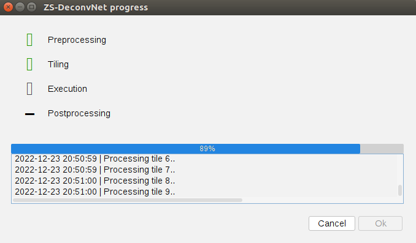

# ZS-DeconvNet

This repository includes the raw data download link, the python and matlab codes, as well as Fiji plugin for the paper "**Zero-shot learning enables instant denoising and super-resolution in optical fluorescence microscopy**".

For a quick start, check the [brief tutorial](https://tristazeng.github.io/ZS-DeconvNet-page/Tutorial/) in our website. ([This website](https://tristazeng.github.io/ZS-DeconvNet-page/) is in continuous update!)

For detailed instructions, see the ReadMe.md in the folder `Python_MATLAB_Codes` or `Fiji_Plugin` respectively.

Here is a 5-step hands-on guide to get you started on our Fiji plugin:

+ Copy `./jars/*` and `./plugins/*` to your root path of Fiji `[your root path of Fiji]/Fiji.app/` from this [link](https://drive.google.com/drive/folders/1nJoj9Ljx2MNXa-lCOGIzVj_1BT-xrp2F), then restart Fiji.

+ Open **Edit > Options > Tensorflow**, and choose the version matching your model or setting. After a message pops up telling you that the library was installed, restart Fiji.
  
  

+ Download one of our [pre-trained_models](https://drive.google.com/drive/folders/14Fh2IDcFykoNf7JvbXJIARi-FukW2rqC) and its test data. The corresponding test data, model type and test data type are listed in `Fiji_pretrained_models_list.xlsx` in the same folder. Open the test data in Fiji and start ZS-DeconvNet plugin by Clicking **Plugins > ZS-DeconvNet > predict**.
  
  

+ Import the chosen model by entering the downloaded path or clicking `Browse`. Click `Adjust mapping of TF network input` and then `OK`.

+ After image processing with status bar shown in the message box (if select `Show progress dialog`), the denoised (if select `Show denoising result`) and deconvolved output will pop out in separate Fiji windows automatically.
  
  
